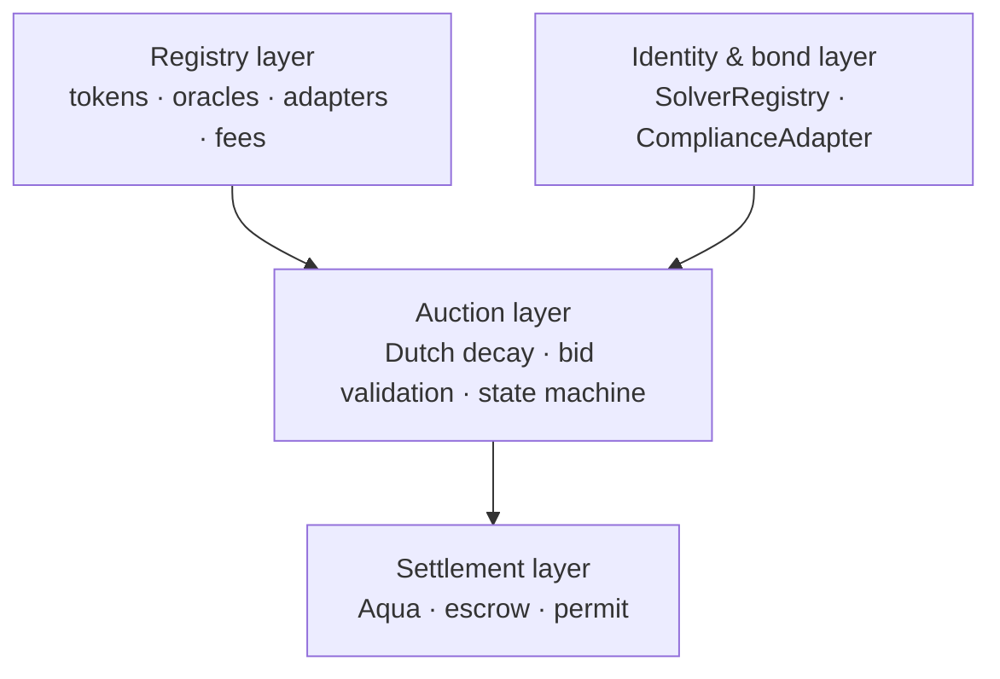

Tessera is a liquidation auction protocol for permissioned real-world assets. It runs Dutch auctions for ERC-3643-style collateral, gates participation through identity registry verification at the issuer's discretion, and settles atomically through a pluggable settlement adapter.

The next pages in this section explain the design choices in detail. This page is the orientation.

## What the protocol is

| Concern | Tessera's answer |
|---|---|
| Who initiates a liquidation? | An allowlisted lending protocol calls `LiquidationRouter.requestLiquidation`. |
| Who decides the price? | A Dutch auction runs from a per-asset-class start price toward a lender-set floor over the asset class's duration. |
| Who can win? | Any solver registered in `SolverRegistry` AND verified in the token's identity registry AND with a registered Aqua strategy for the asset class. |
| How is settlement atomic? | A single transaction performs the compliance check, the Aqua pulls (lender proceeds + protocol fee), the collateral push to the solver, and the auction state transition. |
| What happens if no one bids? | After the deadline, the auction is cancelable and collateral returns to the lender, who falls back to the issuer's forced-transfer mechanism. |

## What the protocol is not

- **Not custody.** Tessera holds collateral only for the duration of the auction. Outside that window, no funds.
- **Not pricing.** The protocol does not compute fair value, set reservation prices, or recommend bids. Solvers do.
- **Not KYC.** The protocol delegates compliance entirely to the issuer's identity registry. Tessera neither KYCs nor de-KYCs.
- **Not a token.** The protocol has no governance token, no reward token, no airdrop. Protocol fees are taken in stablecoins.
- **Not a venue.** Tessera does not match orders. Each auction has at most one winner, settled atomically.

## Why this shape

The design choices follow from the constraints:

<AccordionGroup>
  <Accordion title="Why Dutch auction?" icon="gavel">
    Information asymmetry between solvers favors the well-informed in a Dutch design. Settlement speed favors lenders. Bot complexity is low, broadening the participant set. See [Auction Mechanism](/protocol/auction-mechanism).
  </Accordion>
  <Accordion title="Why settlement adapters?" icon="arrows-rotate">
    Aqua is the default but not an architectural prerequisite. The adapter pattern keeps the auction layer independent of any single settlement primitive. See [Settlement Adapters](/protocol/settlement-adapters).
  </Accordion>
  <Accordion title="Why per-asset-class parameters?" icon="sliders">
    Tokenized treasuries (daily NAV) and tokenized real estate (quarterly NAV) require different staleness windows, different price decay shapes, and different default floors. Uniform parameters would lock out half the long tail.
  </Accordion>
  <Accordion title="Why non-reverting compliance rejection?" icon="ban">
    A non-compliant solver attempting to bid emits `BidRejected` and returns without state change. The auction stays active. The rejection is permanently on-chain — a non-reverting record proves the protocol denied a non-compliant recipient at this block. See [Compliance Model](/protocol/compliance-model).
  </Accordion>
</AccordionGroup>

## The four-layer architecture

Each layer has explicit interfaces. Substituting the settlement primitive requires only a new adapter — the auction layer never changes.

## Reading order

1. **[The composability problem](/protocol/composability-problem)** — why standard liquidation breaks for permissioned RWAs
2. **[Architecture](/protocol/architecture)** — the four layers in detail
3. **[Settlement adapters](/protocol/settlement-adapters)** — Aqua + escrow + permit, and the dependency story
4. **[Auction mechanism](/protocol/auction-mechanism)** — Dutch decay math, parameters, edge cases
5. **[Compliance model](/protocol/compliance-model)** — delegation to the issuer's registry, two-stage verification
6. **[Invariants](/protocol/invariants)** — what the protocol guarantees, and how
